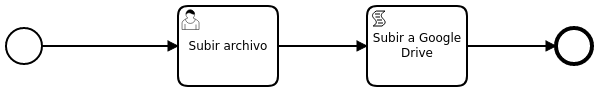

# Upload a file to Google Drive



## Deployment Command

```
curl -w \
-H “Accept: application/json” \
-F “deployment-name=upload-file” \
-F “enable-duplicate-filtering=false” \
-F “deploy-changed-only=falses” \
-F “upload.bpmn=@upload.bpmn” \
-F “drive.js=@drive.js” \
-F “upload_file.html=@upload_file.html” \
http://localhost:8080/engine-rest/deployment/create
```
