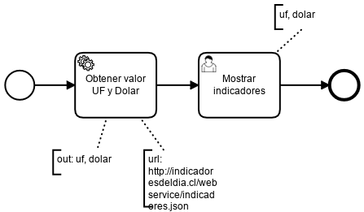

# Consultar Indicadores

|   Nr. | Tópico                                      | Actividad                                                                                                                                                                                                                                                                                                                                                                                                                                                                                                                                                                                                                                                                                                                                                                                                         |
| :---: | :---                                        | :---                                                                                                                                                                                                                                                                                                                                                                                                                                                                                                                                                                                                                                                                                                                                                                                                              |
|     1 | **StartEvent**                              | 1. En la pestaña 'General', configura el parámetro **Initiator** = 'starter'                                                                                                                                                                                                                                                                                                                                                                                                                                                                                                                                                                                                                                                                                                                                      |
|     2 | **'Mostrar indicadores User Task**          | 1. En la pestaña 'General', configura el parámetro **Assignee** = '${starter}'. 2. En la pestaña 'Forms', agrega las siguientes variables del siguiente modo: 2a. **ID** = 'uf, **Type** = 'string', **Label** = 'UF', **Add Constraint** -> **Name** = 'readonly'. 2b. **ID** = 'dolar', **Type** = 'string', **Label** = 'Dolar', **Add Constraint** -> **Name** = 'readonly'.                                                                                                                                                                                                                                                                                                                                                                                                                      |
|     3 | **'Obtener valor UF y Dolar' Service Task** | 1. Configura el parámetro 'Implementation' = 'Connector'.   2. Muévete a la pestaña **Connector**. Configura el parámetro **Connector Id** = 'http-connector'.  3. Agrega los siguientes **Input Parameter**:  3a. **Name** = 'method'. **Type** = 'Text'. **Value** = 'GET'.   3b. **Name** = 'url'. **Type** = 'Text'. **Value** = 'http://indicadoresdeldia.cl/webservice/indicadores.json'. 4. Agrega los siguientes **Output Parameter**:  4a. **Name** = 'uf'. **Type** = 'Script'. **Script Format** = 'javascript'. **Script Type** = 'Inline Script'. **Script** = 'S(response).prop('indicador').prop('uf').value()'.   3b. **Name** = 'dolar'. **Type** = 'Script'. **Script Format** = 'javascript'. **Script Type** = 'Inline Script'. **Script** = 'S(response).prop('moneda').prop('dolar').value()'. |
