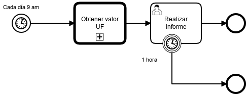

# Informe Diario

|   Nr. | Tópico                                      | Actividad                                                                                                                                                                                                                                                                                                                                                                                                                                                                                                                                                                                                                                                                                                                                                                                                         |
| :---: | :---                                        | :---                                                                                                                                                                                                                                                                                                                                                                                                                                                                                                                                                                                                                                                                                                                                                                                                              |
|     1 | **'Cada día a las 9 A.M.' Timer Start Event** | 1. En la pestaña 'General', configura el parámetro **Timer Definition Type** = 'Duration'.   2. En la pestaña 'General', configura el parámetro **Timer Definition** = '* 9 * * Mon-Fri *'.
|     2 | **'Obtener valor UF' Call Activity** | 1. Configura el parámetro 'CallActivity Type' = 'BPMN'.    2. Configura el parámetro 'Called element' = 'ObtenerIndicadores'.   3. Configura el parámetro 'binding' = 'latest'.   4. Muévete a la pestaña **Variables**.   5. Agrega los siguientes **Out Mappings**:  5a. **Type** = 'Source'. **Source** = 'uf'. **Target** = 'uf'. 
|     3 | **'Realizar Informe' User Task** | 1. En la pestaña 'Forms', agrega las siguientes variables del siguiente modo: 2a. **ID** = 'uf', **Type** = 'string', **Label** = 'UF', **Add Constraint** -> **Name** = 'readonly'. 2b. **ID** = 'reporte', **Type** = 'string', **Label** = 'reporte'
|     4 | **'1 hora' Timer Boundary Event Task** | 1. Configura el parámetro 'Timer Definition Type' = 'Duration'.   Configura el parámetro 'Timer Definition' = 'PT1H'.                                                                                                                                                                                                                                                                                              |
